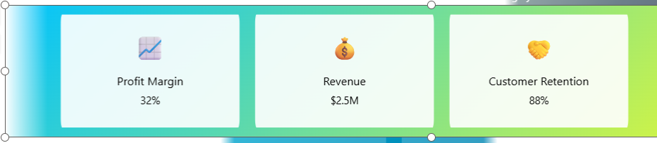
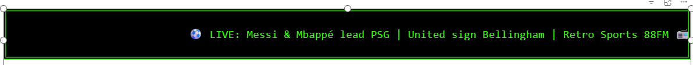

# 📊 Power BI Infinite Scroll Carousels & Retro Tickers

Welcome to my **Power BI Infinite Scroll & Ticker Pack** — a creative way to bring **dynamic scrolling content** into your reports using pure HTML + CSS **inside DAX measures**.

---

## ✅ **What’s inside**

  

- 👥 **Team Cards** — Meet your team with the `ScrollingTeamCard`.

  

- ⚽ **Football Stats** — Loop through player profiles with the `FootballProfileStatsCarousel`.

  

- 💼 **Sales Team Carousel** — Show top performers with the `SalesTeamCarousel`.

  

- 🌍 **Inflation Carousel** — Compare countries visually with the `MakeupCountryInflationCard`.

  

- 🛍️ **Product Carousel** — Highlight products with the `ProductCarousel`.

  

- ⭐ **Customer Testimonial Carousel** — Show customer reviews with the `CustomerTestimonialCarousel`.

  

- 📈 **KPI Highlight Carousel** — Big KPIs on loop with the `KPIHighlightCarousel`.

  

- 🏢 **Company Timeline Carousel** — Your company’s story with the `CompanyTimelineCarousel`.

  

- 📻 **Retro Radio Message Ticker** — 1980s broadcast style with the `RetroRadioMessageTicker`.

  

- 📺 **Ceefax Ticker** — BBC Ceefax blocky style with the `CeefaxTicker`.

- ⏱️ **SpeedControl Table** — Pick your scroll speed using the `SpeedControl`.

---

## 🧩 **How it works**

- Each carousel or ticker is built with **HTML + CSS** wrapped inside a **DAX measure**.
- The `SpeedControl` table makes the speed dynamic.
- Use the **HTML Content Viewer** visual in Power BI to render the HTML.
- **Fully dynamic**, no JavaScript needed.

---

## ✨ **Original Inspiration**

  

These infinite scrolling ideas were inspired by [Temani Afif’s Infinite Scroll Animation](https://codepen.io/t_afif/pen/jOXRGGx).  
I adapted it into reusable DAX measures and a standalone HTML file — with clear inline comments for learning.

---

## 🗂️ **Included Files**

✅ `/html/ScrollingTeamCard.html` — Self-contained HTML version for quick testing.

✅ `/measures/` — Each DAX measure saved by name:
- `ScrollingTeamCard.txt`
- `FootballProfileStatsCarousel.txt`
- `SalesTeamCarousel.txt`
- `MakeupCountryInflationCard.txt`
- `ProductCarousel.txt`
- `CustomerTestimonialCarousel.txt`
- `KPIHighlightCarousel.txt`
- `CompanyTimelineCarousel.txt`
- `RetroRadioMessageTicker.txt`
- `CeefaxTicker.txt`
- `SpeedControlTable.txt`

✅ **SpeedControl Table** — A simple `DATATABLE` that powers the scroll speed slicer.

---

## 💡 **How to use it**

1. Import the `SpeedControl` table.
2. Add your chosen measure to an **HTML Content Viewer** visual.
3. Connect the speed slicer.
4. Watch your infinite scrolling visuals come to life!

---

## 🎉 **Credits**

- Infinite scroll animation: [Temani Afif on CodePen](https://codepen.io/t_afif/pen/jOXRGGx)
- Tidy Power BI version: *[Your Name]*

---

## 🚀 **Clone, learn, tweak!**

If you find this useful, ⭐ star the repo, clone, tweak, and share it!

